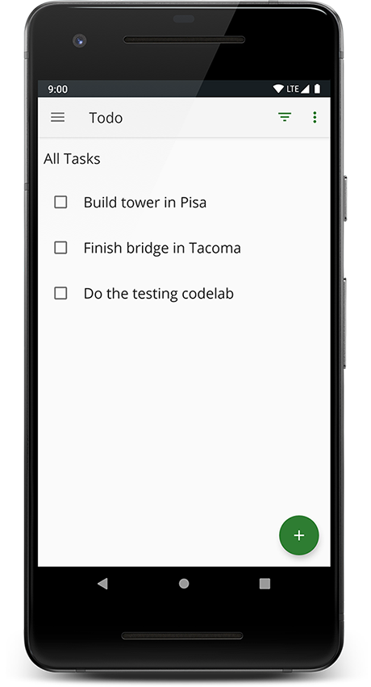

TO-DO Notes - Code for 5.1-5.3 Testing Codelab
============================================================================

Code for the Advanced Android Kotlin Testing Codelab 5.1-5.3

Added some notes about Android Testing which you can find [here](https://github.com/michael-pessoni/android-testing/blob/master/ANDROID%20TESTING%20NOTES.md)

Introduction
------------

TO-DO Notes is an app where you to write down tasks to complete. The app displays them in a list.
You can then mark them as completed or not, filter them and delete them.

You can find out more about this projetc and the codelab in the following links:

Project stages at GitHub:

* [starter_code](https://github.com/googlecodelabs/android-testing/tree/starter_code)
* [end_codelab_1](https://github.com/googlecodelabs/android-testing/tree/end_codelab_1)
* [end_codelab_2](https://github.com/googlecodelabs/android-testing/tree/end_codelab_2)
* [end_codelab_3](https://github.com/googlecodelabs/android-testing/tree/end_codelab_3)

The codelabs in this series are:
* [Testing Basics](https://codelabs.developers.google.com/codelabs/advanced-android-kotlin-training-testing-basics)
* [Introduction to Test Doubles and Dependency Injection](https://codelabs.developers.google.com/codelabs/advanced-android-kotlin-training-testing-test-doubles)
* [Survey of Testing Topics](https://codelabs.developers.google.com/codelabs/advanced-android-kotlin-training-testing-survey)

License
-------

Copyright 2019 Google, Inc.

Licensed to the Apache Software Foundation (ASF) under one or more contributor
license agreements.  See the NOTICE file distributed with this work for
additional information regarding copyright ownership.  The ASF licenses this
file to you under the Apache License, Version 2.0 (the "License"); you may not
use this file except in compliance with the License.  You may obtain a copy of
the License at

  http://www.apache.org/licenses/LICENSE-2.0

Unless required by applicable law or agreed to in writing, software
distributed under the License is distributed on an "AS IS" BASIS, WITHOUT
WARRANTIES OR CONDITIONS OF ANY KIND, either express or implied.  See the
License for the specific language governing permissions and limitations under
the License.
